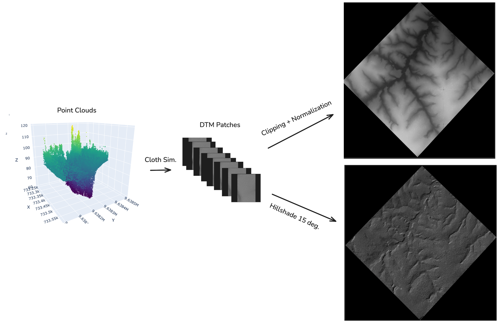
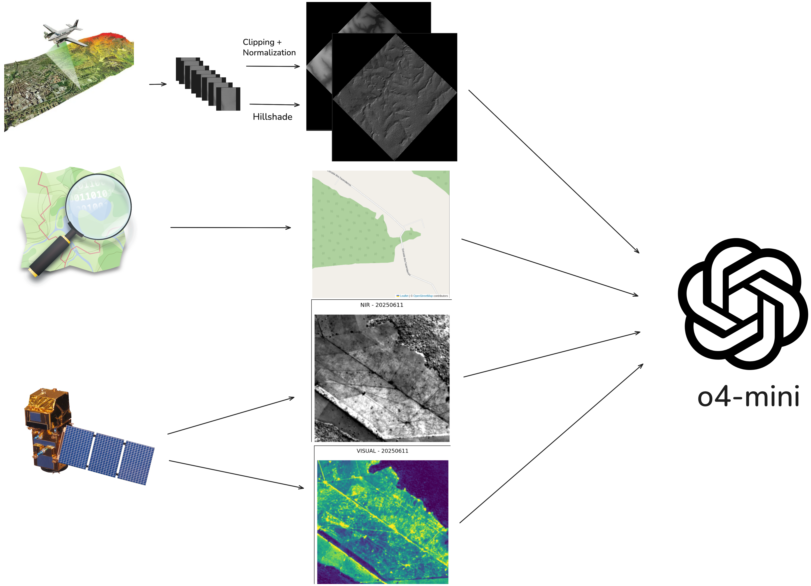
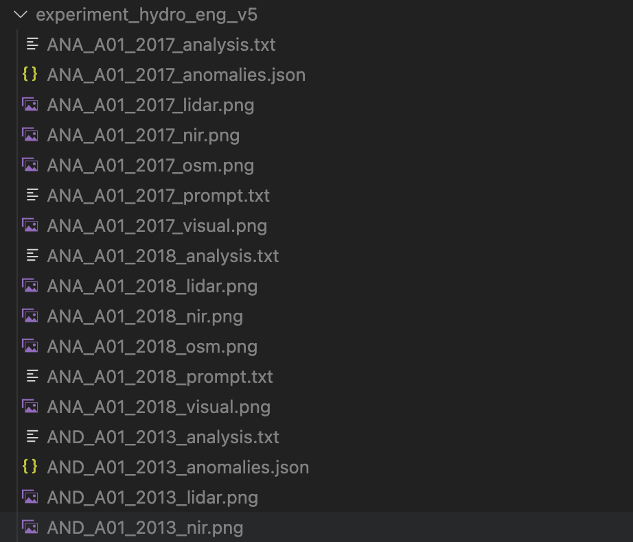
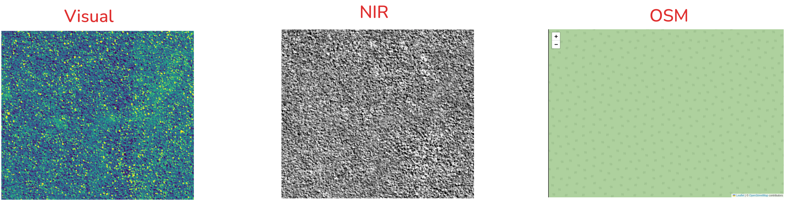

# From Logs to Lost Canals: Ancient Water Management in Jamari National Forest

Samuel Xu

Although Lidar surveys of selective logging in Jamari National Forest have been promising [1], its archaeological potential remains largely unexplored [2]. Here, we leverage recent AI‐driven advances to perform a comprehensive analysis of remote sensing data over 115 000 ha of Amazonian terrain, spotlighting Jamari as a prime candidate for uncovering archaeological features. Within a focused 3.7 x 3.7 km plot, feature extraction revealed canal‐like channels of varying widths and circular farm ponds - anomalies strikingly similar to known pre-Columbian hydrological works elsewhere in the basin [3]. These discoveries suggest a far greater scope and sophistication of Amazonian water management than previously recognized.

I'll take you through the steps of these findings.
## 1. Data Gathering

The plan was to acquire as much high-quality, open source data as possible to analyze. The final format needed to be PNGs, so that we could pass them through to o4-mini.
First, the data sources needed to be figured out. After perusing the web, I came across these sources:

- OpenTopography: 30m-resolution for personal use (permitted), 5m-resolution for verified academic use (not permitted; requires authentication)
- Raw lidar data from various sources from 2008 to 2018 [4]
- Sentinel data downloaded from STAC catalog at https://earth-search.aws.element84.com/v1
- Open Streetmap data for information on existing structures and roads

With this data, the detail of the LiDAR data could be cross-referenced with patterns in the sentinel bands and existing paths and structures in Open Street Map to distinguish potential archaeological anomalies.
## 2. Data Processing

### LIDAR Data

This was the clearest challenge of all, which also clearly would yield the highest-resolution data. The problems were:
- The data was in the form of point clouds
- The data was noisy
- The data was given in patches
- The points had a wide of height, which made viewing in a 0-255 grayscale impractical for some images

To overcome this:
- A Cloth Simulation Filter was applied to each patch of lidar data, which produced Digital Terrain Models of 1m resolution
- The companion .kmz file was used to extract the polygon coordinates containing these data, which was then used to stitch together common regions
- Gaussian smoothing was applied to the resulting DTMs
- A hillshade of 15 degrees and clipping were applied separately to identify features

To re-run our processing pipeline, simply do the following:
1. `python -m pip install -r requirements.txt`
2. Download all the lidar data from [4]
4. Change the `lidar_data_directory` in the `main()` function of `process_lidar.py` to point at your data
3. Run `python process_lidar.py`
4. When that's done, `python stitch_dtms.py`



### Sentinel, Opentopography & Open Streetmap Data

These each have public-facing APIs to query using (lon, lat) bounding box coordinates. For OSM and Opentopography, the raw rasters could readily converted into PNGs. However, Sentinel data provided some challenges:
- some patches were entirely covered by clouds
- some patches were entire black
- there are many bands of data

Moreover, they required some post-processing using their api-provided scale and offset parameters for each given patch of data. Resolving the first two data quality issues was as simple as tuning the cloud cover and filtering out patches with high black pixel percentage. We chose to use NIR band for its correlation with vegetation health and density, as well as the visual band for common sense reasoning about the scene.

## 3. Narrowing down the regions: o4-mini to the rescue!

Now that we had the regions and a pipeline for processing data, we needed a way to sift through all this data to detect potential anomalies. Leveraging recent advances in AI, we could run this pipeline across many regions at once using o4-mini. Given this combination of data, o4-mini could reason across the various types of input to determine the presence of archaeological anomalies.

However, anomalies as a general idea is too general. To be more specific, we decided to focus on things recently uncovered in other parts of the amazon - namely, cultures capable of hydrological engineering through various water management systems.

I also needed the model to have context on the various regions. Since it already has knowledge of the regions by name, we could simply give the exact regions by looking up their coordinates for each lidar chunk on Google, put them in a table, and feed them in. However, we can do better than that - in the spirit of automation, we used Google's free Reverse Geocoding API to calculate the region's detailed name for each (lon, lat) pair on the fly.

Finally, we also re-prompted the model to continually learn from the previous run's insights. By the end of a run, its insights were rather interesting:

```
- When searching for concealed causeways in Amazonian interfluves, focus on slope‐break zones between <2° hilltops and adjacent valleys, since gentle convex crest zones often hosted raised‐field systems.
- Look specifically for paired, linear concavities with a faint central ridge—these “double trough” signatures prove highly diagnostic of canal–causeway alignments when they occur in NE–SW orientation.
- In dense forest, overlay seasonal dry‐season NIR composites: terra preta infill or canal sediments often retain moisture and appear darker than surrounding canopy—even subtle lines 2–3 m wide can show up.
- Use least‐cost path models anchored on any candidate causeway fragment to predict the location of linked fields or satellite canals up to ~2 km away, then re‐inspect those areas for repeating patterns.
- Mask modern linear features (roads, pipelines) with OSM or Sentinel‐1 coherence masks to reduce false positives, especially along river margins where shifting channels can mimic straight lines.
```

For an example prompt, see `example_prompt.txt`.

### Image Pipeline


To run this yourself, do the following:
- Find the `stitched_output_dir` from the `stitch_dtms.py` file used in the previous step.
- Set `stitched_images_dir` in `analyze.py` to the correct stitched images directory
- Set `exp_name` in `analyze.py` to your desired experiment output directory
- Create a `.env` file and set `GOOGLE_EARTH_API_KEY` and `OPENAI_API_KEY`
- Run `python analyze.py`

The script will then output the analysis, along with any anomalies it surfaced in a JSON file. It will also draw the bounding boxes of the anomalies it detects, along with the Sentinel and OSM data extracted. On average, the Jamari National Forest region exhibited a higher anomaly count (23.24) than the other 22 regions across over 10 individual experiment runs (4.39). To see the overlays, simply open the experiments folder and you'll find the overlays gathered for you by region group ID. You'll also find other helpful information included there, such as the geolocation string and past insights.

The most recent experiment run is included in the git directory for convenience.



In total, across over 115 000 ha of Lidar, Satellite and OSM derived analysis, over average over 120 anomalies were surfaced on average.

Another region of interest was São João, Oriximiná - exhibiting also a high number of anomalies. However, after some research into the oral history of Jamari, I believed it to be the more attractive option. It has a varied and rich oral heritage, which underscores that the Jamari forest is not just a wilderness – it is a cultural landscape imbued with the memory of those who have called it home.

In the Jamari National Forest, of particular interest was the JAM_A03_2013 tile, which we'll be diving into in the next section.
## Site of Interest: Jamari National Forest, (-9.08081, -63.00638)

Three features make this location particularly compelling:
1. Linear depressions of consistent depth and width, occurring in two parallel sets in some areas—one shallower, one deeper.
2. Near-perpendicular intersections between north–south and east–west alignments.
3. Circular depressions with notably deeper interiors, all interconnected by the deeper linear channels.

Here are the lidar-derived normalized DTM and hillshade side-by-side:


When viewed in normalized DTM and hillshade, the interconnected circular features and multiple linear widths become immediately apparent. The straight, shallow north–south and east–west lines—visible only in the hillshade—are distinct from the regular 16‑tile LiDAR stitching artifacts.

To exclude modern infrastructure, I overlaid OSM, NIR, and visual-band tiles:



No roads or buildings appear at these coordinates, heightening the intrigue. While selective logging skid marks may explain the shallower depressions, it does not account for the near-perfect straightness of the lines or the deeper channels linking the circular depressions. Ground truthing on site is required to determine their origin.

These channels of several distinct widths and connected pond-like circular depressions were strikingly similar to the descriptions of anomalies in another article published earlier this year detailing a Maize monoculture in the southwestern Amazonia.[3]

This site could play into the varied history of Jamari in unexpected ways. During Francisco de Orellana's expedition in 1541, they encountered a skirmish with warrior women near the junction with the Madeira River. They were never encountered again - and this is only a small piece of Jamari's rich past.
## Discussion

### Cultural Context and Regional Significance

The features identified in Jamari National Forest represent a remarkable addition to the growing archaeological record of pre-Columbian landscape engineering across Amazonia. Recent discoveries have revealed that earthworks are widespread throughout the Amazon basin, with estimates suggesting between 10,272 and 23,648 sites remain to be discovered across the region. The interconnected channels and circular depressions at our study site bear striking similarities to known hydraulic management systems throughout southwestern Amazonia, particularly the complex pre-Columbian floodplain fisheries documented in Bolivia's Llanos de Moxos, which featured V-shaped weirs channeling fish into ponds for capture.

The broader Jamari River region has supported continuous human occupation for millennia, with some of the oldest ceramic traditions in the Americas dating back to 5630 BCE at nearby sites like Pedra Pintada. Within this deep historical context, the Tradição Jamari ceramic tradition represents a specific period of technological and social development spanning approximately 1,000-600 years ago. This timing coincides with what recent research has identified as a period of demographic expansion and landscape intensification across the Amazon basin, where pre-Columbian populations potentially reached carrying capacity before European colonization.

The sophisticated water management features we have documented align with a broader pattern of environmental modification across the southern rim of the Amazon. Archaeological evidence now demonstrates that an 1800 km stretch of southern Amazonia was occupied by earth-building cultures living in fortified villages from approximately Cal AD 1250–1500, suggesting our site represents part of a vast, interconnected network of managed landscapes.

### Hypotheses for Function and Age

#### Aquaculture and Fish Management

The most compelling functional hypothesis for our observed features centers on aquaculture and seasonal fish management. The interconnected circular depressions and varying channel widths closely parallel documented pre-Columbian fishery systems, where weirs channeled out-migrating fish into ponds during seasonal flooding cycles, creating a sophisticated capture system that combined weir-fishing and pond-fishing techniques. The deeper channels connecting circular features at our site may have functioned similarly, directing fish movement during the annual flood pulse that characterizes Amazonian hydrology.

#### Agricultural Water Management

An alternative or complementary function involves agricultural intensification through water control. Pre-Columbian Amazonian societies possessed sophisticated knowledge of earthmoving, riverine dynamics, and soil enrichment techniques that allowed them to create highly productive domesticated landscapes. The linear channels may have regulated water flow for raised field agriculture or managed seasonal inundation of cultivated areas, similar to systems documented throughout the Llanos de Moxos.

#### Temporal Framework

Based on regional ceramic traditions and radiocarbon chronologies from comparable sites, we propose a construction period between 1,000-600 years ago, corresponding to the Tradição Jamari ceramic tradition. This timing aligns with broader patterns of landscape intensification across Amazonia, where major earthwork construction peaked between AD 1000-1500, often occurring within anthropogenic forests that had been actively managed for millennia.

#### Demographic and Social Organization

The scale and coordination required for such extensive earthworks suggests substantial population densities and centralized labor organization. Recent modeling indicates that large-scale pre-Columbian sites co-occurred with domesticated tree species, suggesting Indigenous peoples managed forests rather than clearing them, maintaining essential ecosystem services while supporting complex societies. Our site likely supported communities several times larger than historical indigenous populations in the region, potentially numbering in the thousands.

### Proposed Survey Strategy with Local Partners

#### Community-Centered Approach

Any archaeological investigation at this site must be grounded in collaborative partnership with local indigenous communities and traditional populations. Recent studies across the Western Amazon demonstrate that indigenous communities are faithful stewards of their ancestral lands, with indigenous land tenure strongly correlating with forest conservation. We propose establishing formal partnerships with recognized indigenous organizations in Rondônia, including representatives from groups with historical connections to the Jamari River basin.

#### Multi-Phase Investigation Protocol

**Phase 1: Community Consultation and Traditional Knowledge Integration**

Initial activities will focus on extensive consultation with local indigenous leaders, elders, and traditional ecological knowledge holders. This phase includes:

- Formal meetings with indigenous organizations and traditional communities
- Documentation of oral histories related to the study area
- Integration of traditional place names and cultural landscapes
- Development of culturally appropriate research protocols

**Phase 2: Non-Invasive Remote Sensing Expansion**

Building on our initial LiDAR analysis, we propose:

- High-resolution drone survey with multispectral imaging
- Ground-penetrating radar transects along major features
- Systematic topographic mapping using differential GPS
- Botanical survey to identify anthropogenic forest signatures

**Phase 3: Limited Test Excavations**

Following community approval and appropriate permitting:

- Strategic test units placed to minimize site disturbance
- Priority on dating organic materials and ceramic sequences
- Soil chemistry analysis to identify anthropogenic signatures
- Detailed stratigraphic documentation of feature construction

#### Capacity Building and Benefit Sharing

Central to our approach is ensuring that local communities benefit from and participate in all aspects of the research. This includes:

- Training programs for community members in archaeological field methods
- Development of community-controlled cultural heritage management plans
- Integration of findings into local educational curricula
- Tourism and economic development opportunities aligned with conservation goals

#### Collaborative Research Framework

We propose establishing a formal research consortium including:

- Local indigenous organizations as primary partners
- Brazilian archaeological institutions (particularly UNIR and regional museums)
- International collaborators with expertise in Amazonian archaeology
- Environmental organizations working on forest conservation
- Government agencies responsible for heritage protection

#### Ethical Considerations and Protocols

All research activities will adhere to strict ethical guidelines:

- Free, prior, and informed consent from all relevant communities
- Community ownership of cultural heritage discoveries
- Transparent sharing of all research data and findings
- Long-term commitments to site protection and monitoring
- Integration with existing indigenous territorial rights initiatives

#### Conservation Integration

Archaeological evidence can play a crucial role in present-day debates around indigenous territorial rights, as demonstrated by recent discoveries that confirm the historical presence of indigenous peoples in contested regions. Our research will be designed to support:

- Documentation of indigenous historical presence for land rights cases
- Integration of archaeological sites into protected area management
- Development of cultural landscape conservation strategies
- Strengthening of traditional resource management systems

#### Expected Outcomes and Broader Implications

This collaborative approach should yield:

- Definitive functional interpretation of the hydraulic features
- Refined chronological framework for regional occupation
- Enhanced understanding of pre-Columbian landscape management
- Strengthened indigenous cultural heritage protection
- Model for community-based archaeological research in Amazonia

The Jamari discoveries represent not just an archaeological site, but a window into sophisticated pre-Columbian environmental management that continued for centuries before European contact. These findings underscore that Amazonia has long been guided by intentional human activity, challenging assumptions about pristine wilderness while highlighting the deep history of sustainable landscape management. Through respectful collaboration with local communities, we can honor this heritage while contributing to both scientific understanding and contemporary conservation efforts.

[1] Pinagé, Ekena & Matricardi, Eraldo & Assis Leal, Fabricio & Pedlowski, Marcos. (2016). Estimates of selective logging impacts in tropical forest canopy cover using RapidEye imagery and field data. iForest - Biogeosciences and Forestry. 9. 10.3832/ifor1534-008.

[2] Quétila Souza Barros, Marcus Vinicio Neves d' Oliveira, Evandro Ferreira da Silva, Eric Bastos Görgens, Adriano Ribeiro de Mendonça, Gilson Fernandes da Silva, Cristiano Rodrigues Reis, Leilson Ferreira Gomes, Anelena Lima de Carvalho, Erica Karolina Barros de Oliveira, Nívea Maria Mafra Rodrigues, Quinny Soares Rocha, Indicators for monitoring reduced impact logging in the Brazilian amazon derived from airborne laser scanning technology, Ecological Informatics, Volume 82, 2024,102654, ISSN 1574-9541, https://doi.org/10.1016/j.ecoinf.2024.102654.

[3] Lombardo, U., Hilbert, L., Bentley, M. et al. Maize monoculture supported pre-Columbian urbanism in southwestern Amazonia. Nature 639, 119–123 (2025). https://doi.org/10.1038/s41586-024-08473-y

[4] LiDAR Surveys over Selected Forest Research Sites, Brazilian Amazon, 2008-2018, https://catalog.data.gov/dataset/lidar-surveys-over-selected-forest-research-sites-brazilian-amazon-2008-2018-38601

[5] The Discovery of the Amazon: According to the Account of Friar Gaspar de Carvajal and Other Documents https://archive.org/details/discoveryofamazo0000jose