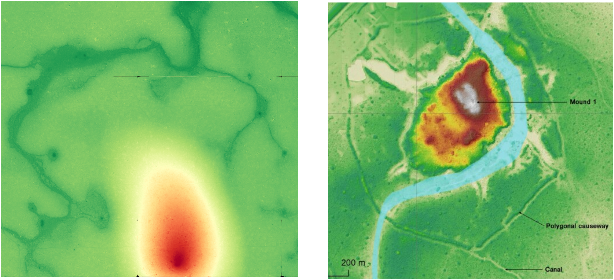

# From Logs to Pyramids and Lost Canals: Ancient Water Management in Jamari National Forest

Samuel Xu

Although Lidar surveys of selective logging in Jamari National Forest have been promising [1], its archaeological potential remains largely unexplored [2]. Here, we leverage recent AI‐driven advances to perform a comprehensive analysis of remote sensing data over 115 000 ha of Amazonian terrain, spotlighting Jamari as a prime candidate for uncovering archaeological features. Within a focused 3.7 x 3.7 km plot, image processing revealed canal‐like channels of varying widths, circular farm ponds, and most surprisingly, a conical pyramid-shaped mound - descriptions that parallel well-studied pre-Columbian agrarian settlements elsewhere in the basin ([3],[6]). These discoveries suggest a greater scope of Amazonian settlement and water management than previously recognized, opening the door for opportunities in furthering archaeological discoveries.

### Roadmap

1. Data Gathering - explaining the sources of data I chose to analyze
2. Data Processing - diving into the mess of cleaning up noisy remote sensing data
3. o4-mini to the rescue! - filtering for regions of highest potential
4. Site of Interest - Within that region, there's a particularly interesting site
5. Discussion and next steps - Tying it all together
7. References

## 1. Data Gathering

The plan was to acquire as much high-quality, open source data as possible to analyze. The final format needed to be images, so that we could pass them through to o4-mini for filtering.
After scouring the web, I came across these sources:

- OpenTopography: 30m-resolution for personal use (permitted), 5m-resolution for verified academic use (not permitted; requires authentication)
    - I opted to only include opentopography for verification of geographical convergence, since 30m is not sufficient for detecting anomalies
- Raw lidar data from various sources from 2008 to 2018 [4]
- Sentinel data downloaded from STAC catalog at https://earth-search.aws.element84.com/v1
- Open Streetmap data for information on existing structures and roads

With this data, the detail of the LiDAR data could be cross-referenced with patterns in the sentinel bands and existing paths and structures in Open Street Map to distinguish potential archaeological anomalies. Initially, Opentopography was used to verify geographical convergence on a single point.

## 2. Data Processing

The raw lidar data spanned over 115 000 ha. Since there's so much data and we are a team of one, the only way I could find a region to focus my analysis on was to feed data spanning specific regions into o4-mini. Hence, the data must be converted into image format, preferably in a state that was easy for me to examine as well. Although LiDAR was a pain, the others proved relatively straightforward. Luckily, it paid dividends later on.

### LIDAR Data

This was the clearest challenge of all, which also ould yield the highest-resolution data. The problems were:
- The data was in the form of point clouds
- The data was noisy
- The data was given in patches
- Some points had a wide variability in height, which made viewing in a uniform 0-255 grayscale map impractical for some images

To overcome this:
- A Cloth Simulation Filter was applied to each patch of lidar data, which produced Digital Terrain Models of 1m resolution (`process_lidar.py`)
- The companion .kmz file was used to extract the polygon coordinates containing these data, which was then used to stitch together common regions (`stitch_dtms.py`)
- Gaussian smoothing was applied to the resulting DTMs (`stitch_dtms.py`)
- A hillshade of 15 degrees and clipping were applied separately to identify features (`stitch_dtms.py`)

To re-run our processing pipeline, simply do the following:
1. `python -m pip install -r requirements.txt` (python 3.10.14)
2. Download all the lidar data from [4]
4. Change the `lidar_data_directory` in the `main()` function of `process_lidar.py` to point at your data path
3. Run `python process_lidar.py`
4. When that's done, run `python stitch_dtms.py`

This process is visualized below. The output path for the stitched DTMs are defined within `stitch_dtms.py` as `stitched_output_dir`.

### LiDAR Processing Pipeline


### Sentinel, Opentopography & Open Streetmap Data

These each have public-facing APIs to query using (lon, lat) bounding box coordinates. For OSM and Opentopography, the raw rasters could readily converted into PNGs. However, Sentinel data provided some challenges:
- some patches were entirely covered by clouds
- some patches were entire black
- there are many bands of data

Moreover, they required some post-processing using their api-provided scale and offset parameters for each given patch of data. Resolving the first two data quality issues was as simple as tuning the cloud cover and filtering out patches with high black pixel percentage. We chose to use NIR band for its correlation with vegetation health and density, as well as the visual band for common sense reasoning about the scene.

## 3. Narrowing down the regions: o4-mini to the rescue!

Now that we had the regions and a pipeline for processing data, we needed a way to sift through all this data to detect potential anomalies. Leveraging recent advances in AI, we could run this pipeline across many regions at once using o4-mini. Given this combination of data, o4-mini could reason across the various types of input to determine the presence of archaeological anomalies. Again, there were a few challenges.

- Anomalies as a general idea is not specific enough. We decided to focus on things recently uncovered in other parts of the amazon - namely, other cultures were shown to be capable of hydrological engineering through various water management systems.
- Since AI can only reach its full potential when sampled multiple times, we thought of a way to aggregate the anomalies so that we could see region-level statistics. The solution was fairly straightforward: we prompt the model to output the bounding boxes of anomalies, and sum across all the lidar chunks to find total number of anomalies per region. 
- We also wanted the model to have context on the various regions. Since it already has pre-trained knowledge of the regions by name, we could simply give the exact regions by looking up their coordinates for each lidar chunk on Google, put them in a table, and feed them in. However, we can do better than that - in the spirit of automation, we used Google Earth's free Reverse Geocoding API to calculate the region's detailed name for each (lon, lat) pair on the fly.

Finally, we also re-prompted the model to continually learn from the previous run's insights. By the end of a run, its insights were rather interesting:

```
- When searching for concealed causeways in Amazonian interfluves, focus on slope‐break zones between <2° hilltops and adjacent valleys, since gentle convex crest zones often hosted raised‐field systems.
- Look specifically for paired, linear concavities with a faint central ridge—these “double trough” signatures prove highly diagnostic of canal–causeway alignments when they occur in NE–SW orientation.
- In dense forest, overlay seasonal dry‐season NIR composites: terra preta infill or canal sediments often retain moisture and appear darker than surrounding canopy—even subtle lines 2–3 m wide can show up.
- Use least‐cost path models anchored on any candidate causeway fragment to predict the location of linked fields or satellite canals up to ~2 km away, then re‐inspect those areas for repeating patterns.
- Mask modern linear features (roads, pipelines) with OSM or Sentinel‐1 coherence masks to reduce false positives, especially along river margins where shifting channels can mimic straight lines.
```

For an example prompt, see `example_prompt.txt`.

### Image Pipeline Details


To run this yourself, do the following:
- Find the `stitched_output_dir` from the `stitch_dtms.py` file used in the previous step.
- Set `stitched_images_dir` in `analyze.py` to the correct stitched images directory
- Set `exp_name` in `analyze.py` to your desired experiment output directory
- Create a `.env` file and set `GOOGLE_EARTH_API_KEY` and `OPENAI_API_KEY`
- Run `analyze.py`

The script will then output the analysis, along with any anomalies it surfaced in a JSON file. It will also draw the bounding boxes of the anomalies it detects, along with the Sentinel and OSM data extracted. On average, the *Jamari National Forest region exhibited a higher anomaly count* (~23) than the other 22 regions across over 10 individual experiment runs (~4). To see the overlays, simply open the experiments folder and you'll find the inputs gathered for you by region group ID prefix. You'll also find other helpful information included there, such as the geolocation string and past insights within each `*_prompt.txt`.

The most recent experiment run is included in the git directory for convenience.

### Directory Structure


In total, across over 115 000 ha of Lidar, Satellite and OSM derived analysis, over 120 anomalies were surfaced on average per experiment run.

Another region of interest was São João, Oriximiná - exhibiting also a high number of anomalies. However, after some research into the oral history of Jamari, I believed it to be the more attractive option because of an apparent lack of archaeologically-focused analysis of the extensive LiDAR surveys. Instead, the articles of note on the Jamari are focused on selective logging impact and conservation efforts.

In the Jamari National Forest, of particular interest was the JAM_A03_2013 tile, which we'll be diving into in the next section.

## 4. Site of Interest: Jamari National Forest, (-9.08081, -63.00638)

At a first glance, four features make this location particularly compelling:
1. Linear depressions of consistent depth and width, occurring in two parallel sets in some areas—one shallower, one deeper.
2. Near-perpendicular intersections between north–south and east–west alignments.
3. Circular depressions with notably deeper interiors, all interconnected by the deeper linear channels.

Here are the lidar-derived normalized DTM and hillshade side-by-side:


When viewed in normalized DTM and hillshade, the interconnected circular features and multiple linear widths become immediately apparent. The straight, shallow north–south and east–west lines—visible only in the hillshade—are distinct from the regular 16‑tile LiDAR stitching artifacts.

To exclude modern infrastructure, I overlaid OSM, NIR, and visual-band tiles:


No roads or buildings appear at these coordinates, heightening the intrigue. However, according to [1], selective logging leaves skid marks which may explain the shallower depressions. However, this does not account for the many other circular and curvilinear depressions, nor the deeper channels linking the circular depressions. Ground truthing on site may be required to determine their origin.

### Connections

Now we will highlight several anomalous sites of interest, applied to both the hillshade and the normalized DTM. We will also make connections to other archaeological sites in the Amazon. Below are the hillshade (left) and normalized DTM (right), with anomalous features highlighted in red boxes.


These channels of several distinct widths (4b,5b,6b) and connected pond-like circular depressions (2,4,5) bear a resemblance to the descriptions of anomalies in another article published earlier this year [3] detailing a Maize monoculture in the southwestern Amazonia insofar as details of channels of distinct orders of width and round farm ponds. Moreover, site 1a has a rectangular perimeter with several rectangular shapes inside, a clear and surprising departure from the surrounding round geoglyphs. This one in particular bears a resemblance to rectangular sites found in other parts of the Bolivian Amazon [6], also surfaced with LiDAR.

Finally, we note that oddly, left of site 5b, there's a white blotch. It is the consequence of an area being more than 8x the standard deviation of the rest of the site, hence the normalization process has cut it off (see the clip operation in `stitch_dtms.py`). You can also see in the hillshade, to the left of 5a that this area is elevated with a notable peak. Since there are no indicators of this being a modern man-made hill, one could easily draw comparisons between this site and the central conical pyramid of the Llanos de Mojo site [6].

Following this thread, below is a side-by-side comparison our conical mound detected (left) generated by `python generate_contour.py` and the verified conical pyramid from the Llanos de Mojo site on the right. They are similarly surrounded by other causeways which extend in both cases to areas on either side of a significant depression that has the s-shape of a river. Our script calculates the height of these to be 16m above the surrounding terrain. For comparison, the Llanos de Mojo pyramids were up to 22m tall.



In summary, upon detailed analysis we found:
- A conical pyramid towering 16m over the rest of the mostly flat terrain similar in appearance, height, and location  as the mound pyramid of Llanos de Mojo
- Circular depressions with deeper centers, similar in appearance to the farm ponds of other sites
- Channels of varying width and depth connecting said circular depressions in unnatural geometric shapes - a right angle, a triangle

Alone, each piece of evidence may be circumstantial, but together it paints a picture of an agrarian-based, low-density urbanism not unlike the monumental sites of Llanos de Mojo. It's possible that the previous surveys, in their endeavour to document the patterns of selective logging, other researchers missed entirely these exciting discoveries. 

This site could play into the varied history of Jamari in unexpected ways. Either way, it poses questions that beg to be answered. During Francisco de Orellana's expedition in 1541 [5], they encountered a skirmish with warrior women near the junction with the Madeira River of which the Jamari is a significant tributary. They were never encountered again - this is only a small piece of Jamari's rich past, of which these sites could offer a glimpse into.

## Discussion

The recent identification of archaeological anomalies within Jamari National Forest opens an exciting new chapter in understanding Amazonian pre-Columbian societies. The identified features—linear and curvilinear channels, circular depressions resembling agricultural ponds, and notably, a conical pyramid-shaped mound—share striking similarities with previously documented agrarian settlements across the broader Amazon basin, particularly the well-studied monumental earthworks found at Llanos de Mojos in Bolivia ([3],[6]). This alignment strongly suggests a cultural and functional parallel, indicative of sophisticated water management and agricultural practices within a potential low-density urban framework.

The diversity and arrangement of these earthworks raise compelling hypotheses about their functions and chronological context. Given the geometric precision and complexity of the canal networks, along with their association with circular depressions indicative of managed agriculture, it is plausible that these structures served dual purposes—both irrigation and aquaculture. The clear rectilinear anomaly (site 1a), juxtaposed against the predominantly circular geoglyphs, invites speculation on ceremonial or specialized functional uses, similar to patterns observed elsewhere in southwestern Amazonia. The presence of the conical mound, analogous to known ceremonial structures from Llanos de Mojos, further strengthens the hypothesis of an integrated socio-political or religious dimension to the site.

Chronologically, although precise dating requires further ground validation and stratigraphic analysis, comparisons with analogous sites suggest a temporal framework broadly aligning with established pre-Columbian agrarian settlements from approximately 1000–1400 CE. Ground-truthing and archaeological excavation would clarify and refine this dating, solidifying Jamari’s position within the pre-Columbian narrative of Amazonia.

To advance this research effectively and responsibly, collaborative surveys and excavations with local and Indigenous communities are crucial. Indigenous oral histories and traditional ecological knowledge may provide valuable insights and interpretations not immediately apparent from remote sensing alone. Partnering with regional institutions and local Indigenous groups such as the Karipuna and other communities who maintain historical and cultural ties to the region would enrich our interpretations and ensure culturally sensitive and contextually informed research practices.

Future work should prioritize targeted archaeological excavation at key anomaly sites, radiocarbon dating of stratified deposits, and thorough ethnographic engagement with local communities. Additionally, expanded remote sensing surveys and comparative analyses with nearby regions are essential to understanding the extent and interconnectedness of these potentially significant archaeological landscapes. Ultimately, this integrative approach promises not only to illuminate the archaeological mysteries of Jamari but also to deepen appreciation for the rich cultural heritage of Amazonia.

## References

[1] Pinagé, Ekena & Matricardi, Eraldo & Assis Leal, Fabricio & Pedlowski, Marcos. (2016). Estimates of selective logging impacts in tropical forest canopy cover using RapidEye imagery and field data. iForest - Biogeosciences and Forestry. 9. 10.3832/ifor1534-008.

[2] Quétila Souza Barros, Marcus Vinicio Neves d' Oliveira, Evandro Ferreira da Silva, Eric Bastos Görgens, Adriano Ribeiro de Mendonça, Gilson Fernandes da Silva, Cristiano Rodrigues Reis, Leilson Ferreira Gomes, Anelena Lima de Carvalho, Erica Karolina Barros de Oliveira, Nívea Maria Mafra Rodrigues, Quinny Soares Rocha, Indicators for monitoring reduced impact logging in the Brazilian amazon derived from airborne laser scanning technology, Ecological Informatics, Volume 82, 2024,102654, ISSN 1574-9541, https://doi.org/10.1016/j.ecoinf.2024.102654.

[3] Lombardo, U., Hilbert, L., Bentley, M. et al. Maize monoculture supported pre-Columbian urbanism in southwestern Amazonia. Nature 639, 119–123 (2025). https://doi.org/10.1038/s41586-024-08473-y

[4] LiDAR Surveys over Selected Forest Research Sites, Brazilian Amazon, 2008-2018, https://catalog.data.gov/dataset/lidar-surveys-over-selected-forest-research-sites-brazilian-amazon-2008-2018-38601

[5] The Discovery of the Amazon: According to the Account of Friar Gaspar de Carvajal and Other Documents https://archive.org/details/discoveryofamazo0000jose

[6] Prümers H, Betancourt CJ, Iriarte J, Robinson M, Schaich M. Lidar reveals pre-Hispanic low-density urbanism in the Bolivian Amazon. Nature. 2022 Jun;606(7913):325-328. doi: 10.1038/s41586-022-04780-4. Epub 2022 May 25. PMID: 35614221; PMCID: PMC9177426.